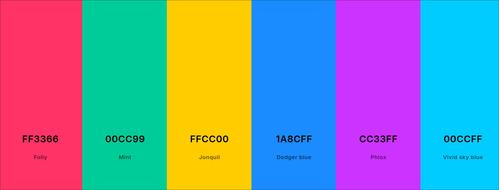

# Shenzhen Nights

  
  <!-- Add other badges here if desired (e.g., license, build status) -->

  

A color theme with a cyberpunk manufacturing aesthetic, inspired by the world's electronics capital and its neon glow.

以深圳这座世界电子之都及其霓虹光影为灵感，打造的赛博朋克制造美学配色主题。

## Previews

<table>
  <tr>
    <td align="center">Kitty Terminal</td>
    <td align="center">Visual Studio Code</td>
  </tr>
  <tr>
    <td></td>
    <td></td>
  </tr>
</table>

## Supported Applications

Installation instructions can be found within each application's directory in `apps/`.

*   [Ghostty Terminal](https://ghostty.org/) (`apps/ghostty/`)
*   [Kitty Terminal](https://sw.kovidgoyal.net/kitty/) (`apps/kitty/`)
*   [Visual Studio Code](https://code.visualstudio.com/) (`apps/vscode/`)

## Palette

The base color palette is defined in `palette/colors.yaml`. Here are the main colors:

*   **Background:** `#0a0f14`
*   **Foreground:** `#e5e1db`
*   **Accents:** `#ff3366` (Red), `#00cc99` (Green), `#ffcc00` (Yellow), `#1a8cff` (Blue), `#cc33ff` (Magenta), `#00ccff` (Cyan)

*(See the `palette/colors.yaml` file for the full list, including ANSI colors and UI elements.)*

## License

This project is licensed under the MIT License - see the [LICENSE](./LICENSE) file for details. 
