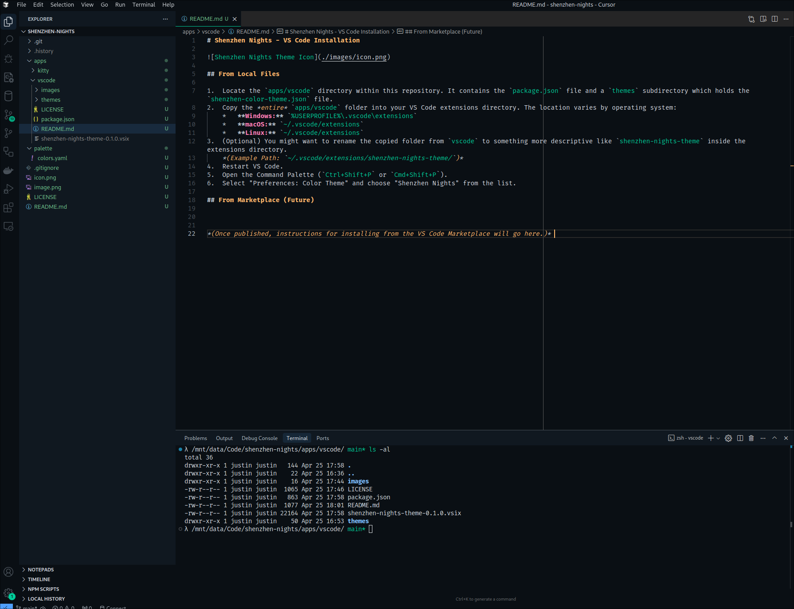

<h1 align="center">🌃 Shenzhen Nights 🌃</h1>

  <a href="https://github.com/brickfrog/shenzhen-nights">Repository</a> |
  <a href="https://github.com/brickfrog/shenzhen-nights/issues">Issues</a>
    

<h2 align="center">Preview</h2>

## Installation

*(Installation instructions will be updated once the theme is published to the VS Code Marketplace. You'll typically search for "Shenzhen Nights" or `justinvc.shenzhen-nights-theme`)*

## License

[MIT License](./LICENSE)
